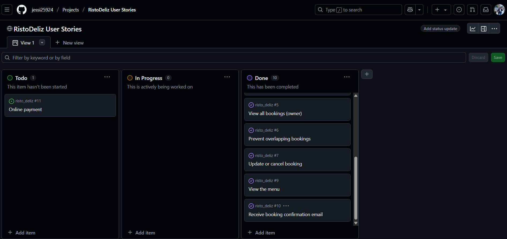
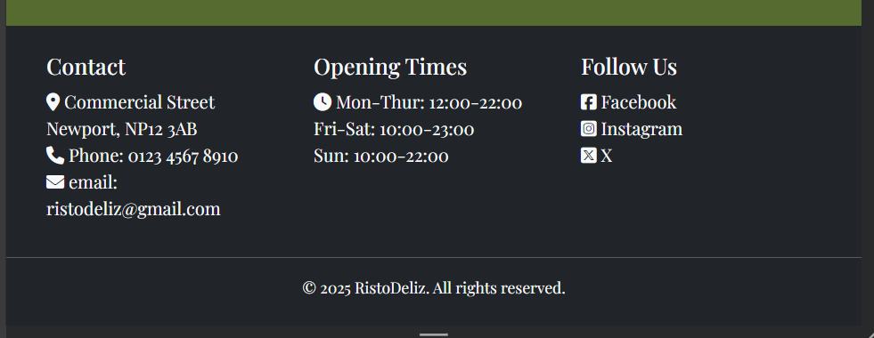
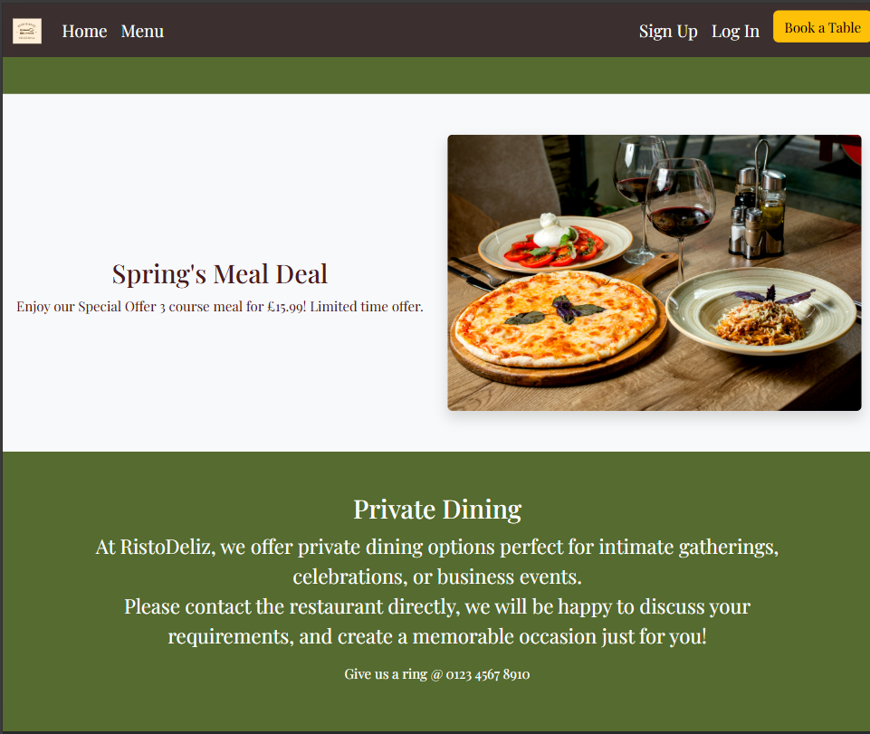
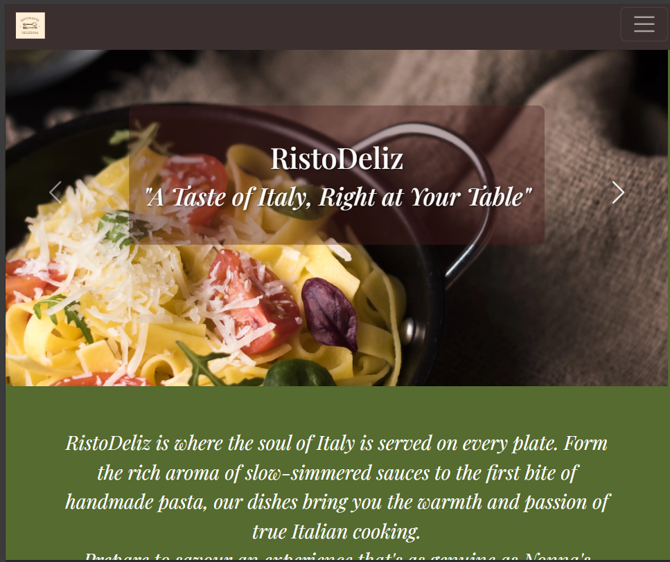
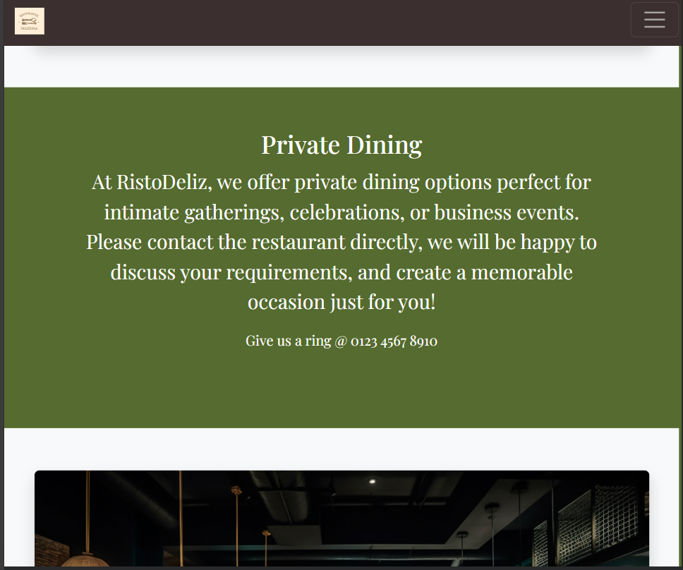
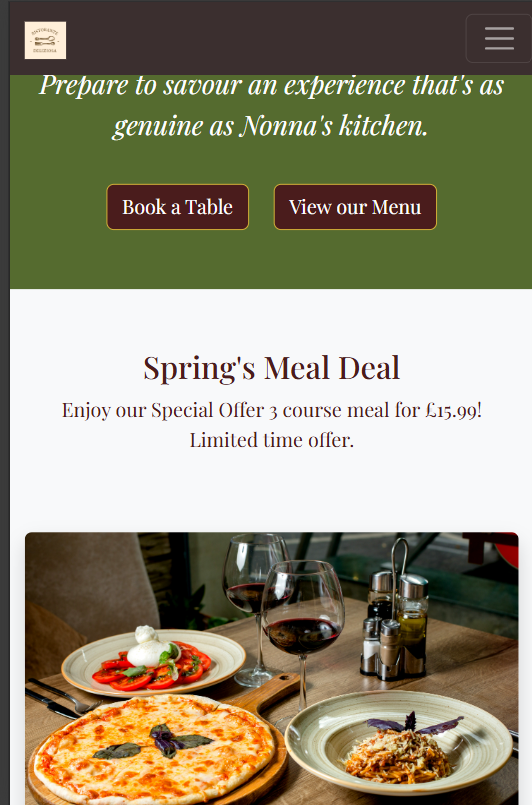
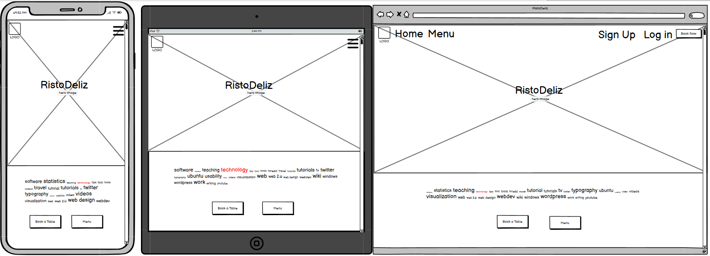
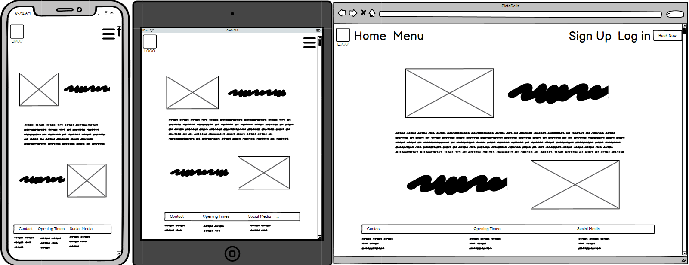

# risto_deliz (Milestone Project 3)

##

## Overview

This project is a restaurant booking system that allows customers to easily reserve tables online through a simple and intuitive interface. Users can register, log in, and make bookings by selecting a date, choosing a time slot, and entering the number of guests.
The system enforces a maximum capacity of 20 guests per time/date slot, preventing overbooking and ensuring efficient table management. This rule is consistently applied on the user-facing site and the admin panel. When a time/date slot is fully booked, users are notified and prompted to choose a different time or reduce their party size. 
Registered users can book tables and manage reservations through a personalised dashboard, with options to edit or cancel bookings. Upon submitting a booking request, users receive a confirmation message. Overall, the system provides a seamless, controlled, and user-friendly reservation experience from start to finish.

## Table of Contents

## Project Goals

The goal of this project is to provide an efficient and user-friendly platform for customers to book restaurant tables online, while helping restaurant staff manage reservations seamlessly. By automating availability checks and offerring self-service features like account creation, booking management, and real-time confirmations. The system aims to improve the overall dining reservation experience and reduce the risk of overbooking or scheduling conflicts.

## User Stories

As a **User**, I want to:

- Sign up so that I can create an account and manage my bookings.
- Log in so that I can securely view, create, update, or cancel my bookings.
- Select a date and time, and the number of guests so that I can book a table for my party.
- Know if the date and time is not available so that I avoid double-booking.
- update or cancel my existing booking so that I can change plans without contacting the restaurant directly.
- view the restaurant’s menu while booking so that I can plan my meal in advance.
- receive an email confirmation after booking so that I have a record of my reservation.
- the system to automatically assign me an appropriate table and prevent bookings that would exceed the restaurant’s 20-guest capacity per time slot so that I can be confident my reservation is both confirmed and within the restaurant’s limits, and I receive clear feedback if my requested slot is full.

As a **Site owner**, I want to:

- Mark a booking as "Confirmed", "Cancelled", “Completed” or “No-show” so that I can keep accurate records of actual seating.
- view a list of all bookings so that I can manage the restaurant’s schedule (CRUD).
- prevent overlapping bookings for the same table at the same date/time so that I avoid double-bookings.

As a **Developer**, I want to:

- Design a clear and logical booking flow so that users can reserve a table without confusion or unnecessary steps.
- Ensure that bookings are accurately recorded and reflect real-time availability to prevent double bookings.
- Create a system that supports both customer-facing features and administrative needs to ensure smooth operation for both users and the site owner.
- Provide users with the ability to manage their bookings independently so they can view, update, or cancel their reservations easily.
- Ensure the application is responsive and intuitive so that it works well on different devices and provides a positive user experience.

The development of this project was guided by **Agile principles**, promoting flexibility, user feedback, and iterative improvement. User stories were created to reflect real user needs and managed through a Kanban board style in GitHub Projects. To prioritise features effectively, the MoSCoW method was used—categorising tasks into **Must Have, Should Have, Could Have, and Won’t Have** for now. This helped streamline development by focusing first on essential functionality. Working in short, focused iterations made it easier to test, evaluate, and refine the system regularly. A backlog of lower-priority or out-of-scope features was maintained for future planning, keeping the initial release manageable while ensuring room for growth.

**GitHub Project in a Kanban board style**

## Features

### Existing Features
The Restaurant Booking System includes the following core features to ensure a smooth and user-friendly dining reservation experience:

#### Header
- Consistent navigation bar displayed across all pages.
- Includes links to key pages: Logo (Home), Home, Menu, Sign Up, Log In, Book a Table. When logged in, links include Logout and My Account.
- Responsive design ensures menu collapses into a hamburger icon on tablet and mobile screens.

View Navigation Feature Screenshots Here

| Device / Comment                    | Screenshot                                        |
| ------------------------ | -------------------------------------------------------------------------- |
| **Desktop**                |                             |
| **Desktop**/logged In                |                             |
| **Tablet**               |                         |
| **Mobile**               |                         |

#### Footer
- Present on all pages.
- Displays business information such as Contacts and Opening Times, Social media icons, and Copyright.
- Styled consistently with the overall theme and responsive across devices.

View Footer Feature Screenshots Here

| Device                  | Screenshots                                        |
| ------------------------ | -------------------------------------------------------------------------- |
| **Desktop**              |                             |
| **Tablet**               |                         |
| **Mobile**               |                         |

#### Home Page
- Welcoming landing page introducing the restaurant.
- Includes information about the venue, ambiance, and offerings.
- Prominent call-to-action buttons such as **Book a Table** or **View our Menu**.
- Visually engaging design with high quality imagery and easy navigation.

View Home Page Feature Screenshots Here

| Device                  | Screenshots  |                      |                   |             
| ------------------------ | -------------------------- | ----------------------- | ------------------------- |
| **Desktop** |  |  |  |
| **Tablet** |  |  |  |
| **Mobile** |  |  |  |

## Design Choices

### Wireframe

The wireframes provided a clear visual guide for the structure and layout of the site before development began. They helped me plan user flow, design decisions, and ensure a smooth user experience across different screen sizes.

Balsamiq Wireframes

| Page                     | Screenshot (Mobile, Tablet, Desktop)                                       |
| ------------------------ | -------------------------------------------------------------------------- |
| **Home**                 |                             |
| **Home-2**               |                         |
| **SignUp**               |                              |
| **Booking Form**         |                  |
| **Booking Confirmation** |  |
| **Menu**                 |                                  |
| **LogIn**                |                                |
| **Dashboard**            |                        |
| **Edit Booking**         |                  |
| **Cancel Booking**       |              |
| **Cancel Confirmation**  |    |

### Font

Playfair Display was chosen from [Google Fonts](https://fonts.google.com/specimen/Playfair+Display) for the font style to give the site a refined and stylish appearance, fitting for a restaurant brand.

### Colour Scheme

The colour palette for this site was generated using [Color Adobe](https://color.adobe.com/create/color-wheel). The colour palette was chosen to create a warm, inviting atmosphere that reflects the character of a quality dining experience.

## Technologies Used

## Testing (Manual and Automated)

## Deployment (Heroku)

## Credits

### Media and Tools

### Content

### Code

### Acknowledgement
