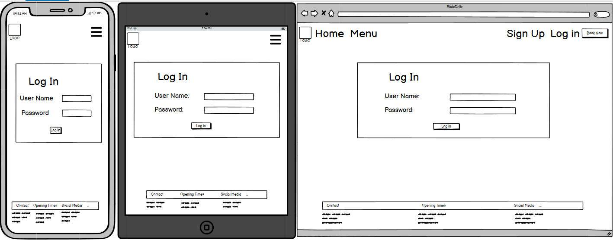
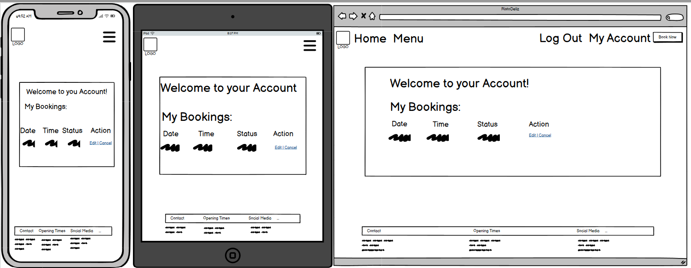
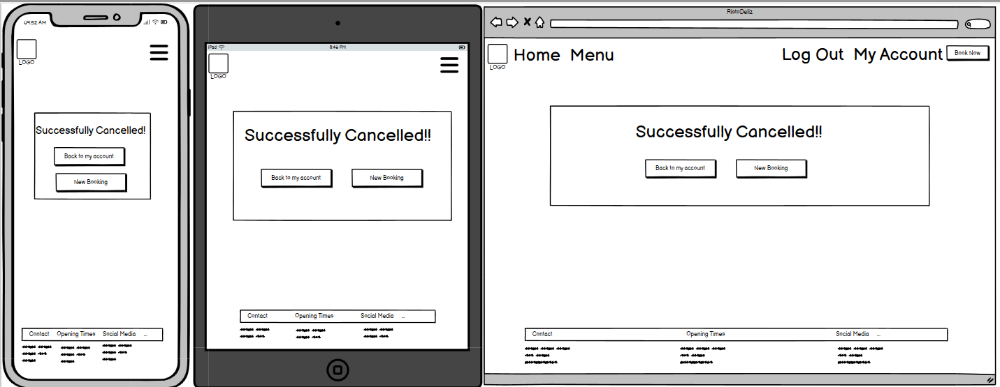

# risto_deliz (Milestone Project 3)

##

## Overview

This project is a restaurant booking system developed using Django, Bootstrap and PostgreSQL. This web applicaiton allows customers to reserve tables online with ease. User can pick a date, choose a time slots, and enter the number of guests through a simple and intuitive interface. Users can create an account, registered users can submit table bookings, and manage their reservations through a personalised dashboard. The system ensures that only available time slots are obtainable to book and includes validaiton to prevent double bookings. Users have the option to edit or cancel their reservations directly from their dashboard, enhancing overall convenience and control. Upon submitting a reservation, users can receive a booking request confirmation, making the entire experience seamless and user-friendly from the start to finish.

## Table of Contents

## Project Goals

The goal of this project is to provide an efficient and user-friendly platform for customers to book restaurant tables online, while helping restaurant staff manage reservations seamlessly. By automating availability checks and offerring self-service features like account creation, booking management, and real-time confirmations. The system aims to improve the overall dining reservation experience and reduce the risk of overbooking or scheduling conflicts.

## User Stories

As a **User**, I want to:

- Sign up so that I can create an account and manage my bookings.
- Log in so that I can securely view, create, update, or cancel my bookings.
- Select a date and time, and the number of guests so that I can book a table for my party.
- Know if the date and time is not available so that I avoid double-booking.
- update or cancel my existing booking so that I can change plans without contacting the restaurant directly.
- view the restaurant’s menu while booking so that I can plan my meal in advance.
- receive an email confirmation after booking so that I have a record of my reservation.

As a **Site owner**, I want to:

- Mark a booking as "Confirmed", "Cancelled", “Completed” or “No-show” so that I can keep accurate records of actual seating.
- view a list of all bookings so that I can manage the restaurant’s schedule (CRUD).
- prevent overlapping bookings for the same table at the same date/time so that I avoid double-bookings.

As a **Developer**, I want to:

- Design a clear and logical booking flow so that users can reserve a table without confusion or unnecessary steps.
- Ensure that bookings are accurately recorded and reflect real-time availability to prevent double bookings.
- Create a system that supports both customer-facing features and administrative needs to ensure smooth operation for both users and the site owner.
- Provide users with the ability to manage their bookings independently so they can view, update, or cancel their reservations easily.
- Ensure the application is responsive and intuitive so that it works well on different devices and provides a positive user experience.

This project followed the Agile development paradigm, which emphasises flexibility and iterative progress. User stories were created to represent real user needs and were managed through GitHub Projects using a Kanban-style board. This allowed me to break down the development process into smaller, actionable tasks, prioritise features, and track progress effectively. By working in short, focused development cycles, I was able to regularly test, evaluate, and improve the application, ensuring that key features were delivered incrementally. This approach reflects common Agile practices such as continuous iteration, user-focused development, and adaptability. A backlog of user stories that were either lower priority or out of scope for the current version was maintained, allowing for flexibility and future planning while keeping the initial build streamlined and manageable.

**GitHub Project in a Kanban-style board**

### Wireframe

The wireframes provided a clear visual guide for the structure and layout of the site before development began. They helped me plan user flow, design decisions, and ensure a smooth user experience across different screen sizes.

Balsamiq Wireframes

| Page                     | Screenshot (Mobile, Tablet, Desktop)                                       |
| ------------------------ | -------------------------------------------------------------------------- |
| **Home**                 |                             |
| **Home-2**               |                         |
| **SignUp**               |                              |
| **Booking Form**         |                  |
| **Booking Confirmation** |  |
| **Menu**                 |                                  |
| **LogIn**                |                                |
| **Dashboard**            |                        |
| **Edit Booking**         |                  |
| **Cancel Booking**       |              |
| **Cancel Confirmation**  |    |

