# Testing
This project was tested manually to verify core functionality and usability. No automated testing was implemented.

## Table of Contents

- [Validation](#validation)
- [Responsiveness](#responsiveness)
- [Browser Compatibility](#browser-compatibility)
- [Manual Testing](#manual-testing)
- [User Stories](#user-stories)
- [Bug](#bug)

## Validation

- To validate all HTML files, the recommended validator service by Code Institute which is [HTML Validator](https://validator.w3.org/) was used.

| Page      | Comment   | Screenshot         |
| --------- | --------- | ------------------ |
| Home/Base | No Errors |  |
|           | No Errors |  |
|           | No Errors |  |
|           | No Errors |  |
|           | No Errors |  |

- To validate the CSS file, the recommended validator service by Code Institute which is [CSS Validator](https://jigsaw.w3.org/css-validator/) was used.

| Validator                                          | Comment  | Screenshot                                    |
| -------------------------------------------------- | -------- | --------------------------------------------- |
| [Jigsaw W3C](https://jigsaw.w3.org/css-validator/) | No Error | 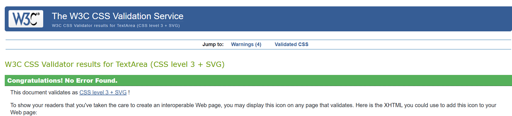 |

- To validate Python code, the recommended validator service by Code Institute which is [Python PEP8 Checker](https://ww7.pep8online.com/?usid=24&utid=12257950545) was used.

 
 **
 View Python Code Testing 
**

| File              | Comment | Screenshot         |
| ----------------- | ------- | ------------------ |
| **risto_deliz**   |         |                    |
| **setting.py**    |         |  |
| **url.py**        |         |  |
| **booking_table** |         |                    |
| **admin.py**      |         |  |
| **apps.py**       |         |  |
| **forms.py**      |         |  |
| **models.py**     |         |  |
| **views.py**      |         |  |

 

- For auditing Performance, Accessibility, and Best Practices [Developer Tools Lighthouse](https://developer.chrome.com/docs/lighthouse/overview/) was used.

 

 
 **
 View Lighthouse Testing 
**

| Device      | Page         | Screenshot                                   |
| ----------- | ------------ | -------------------------------------------- |
| **Desktop** | Home         | 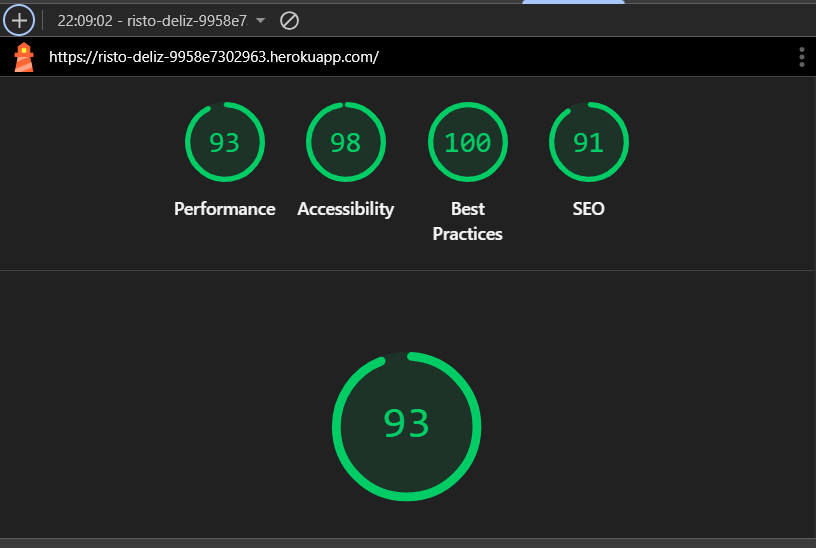 |
| **Mobile**  | Home         | 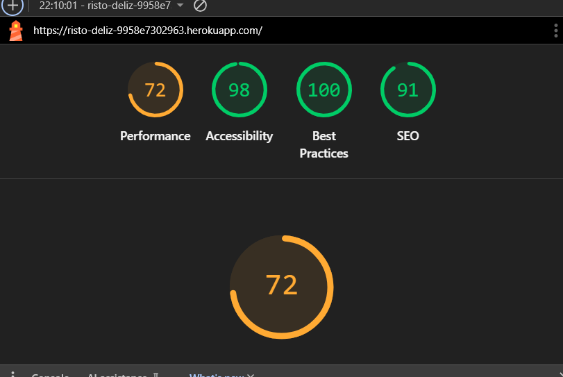 |
| **Desktop** | Menu         | 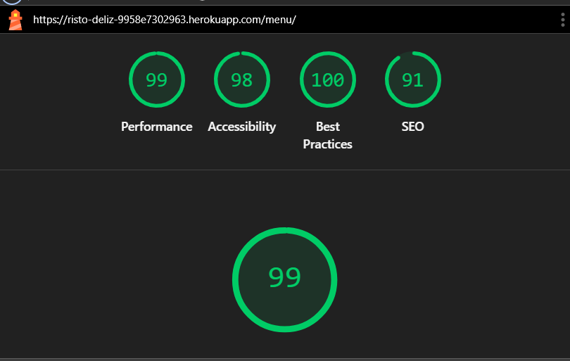 |
| **Mobile**  | Menu         | 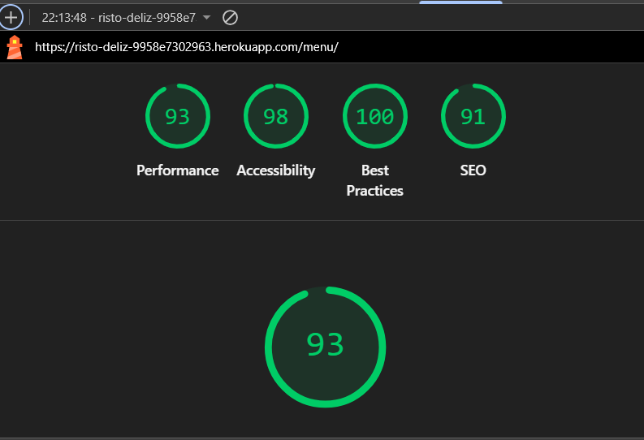 |
| **Desktop** | Booking form | 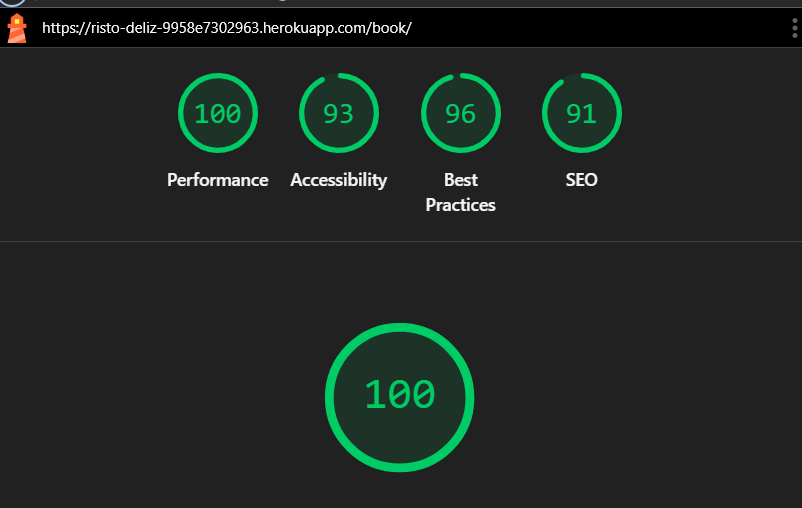 |
| **Mobile**  | Booking form | 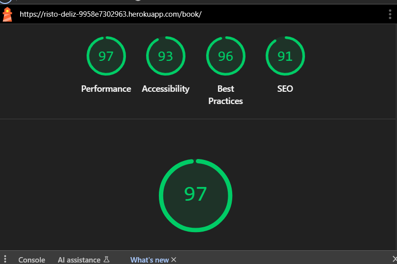 |
| **Desktop** | My Account   | 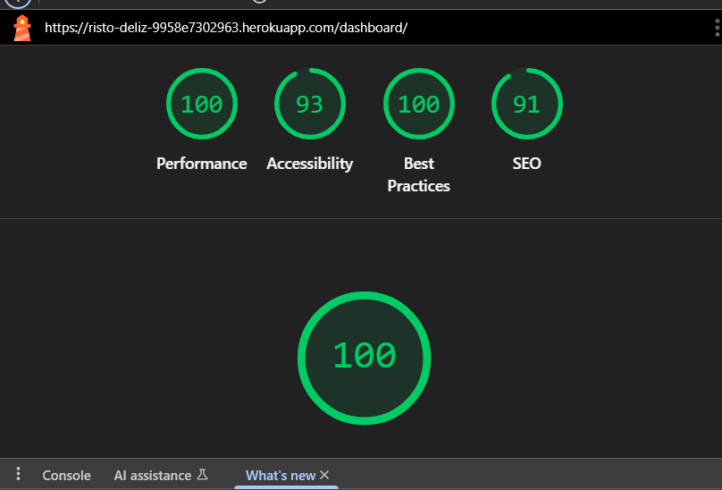 |
| **Mobile**  | My Account   | 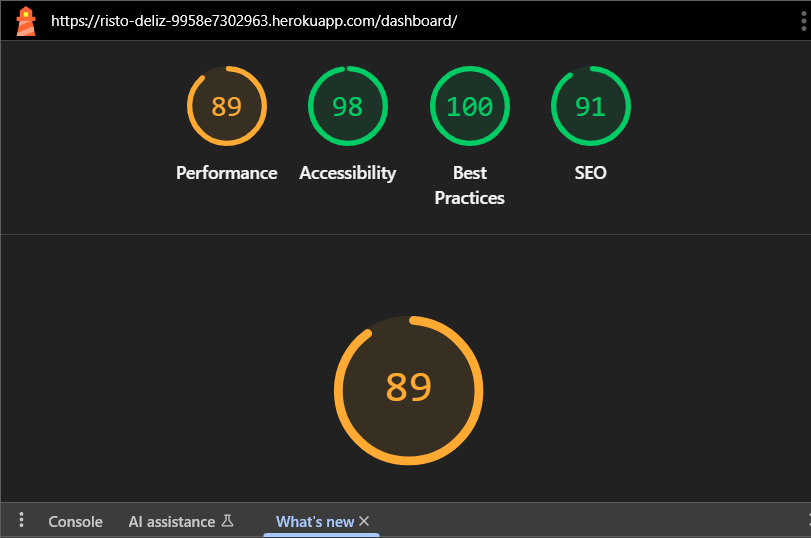 |
| **Desktop** | Edit booking | 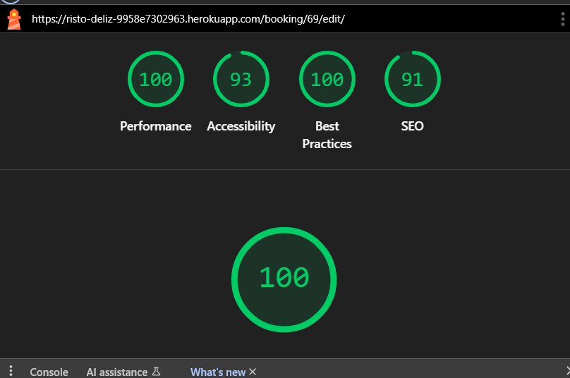 |
| **Mobile**  | Edit booking | 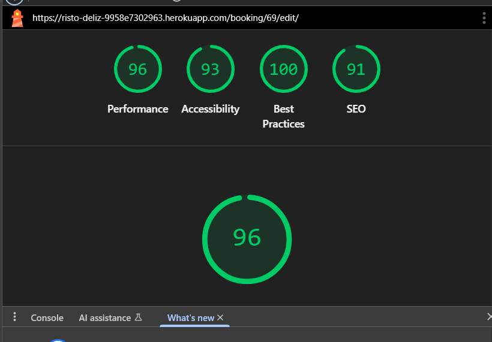 |

 

[Back To Top](#table-of-contents)

## Responsiveness
- The application was tested to ensure it will respond correctly on desktop, tablet, and mobile devices, maintaining usability and layout integrity.

 
 
View Responsiveness Screenshot on Different Devices

| Device      | Comment | Screenshot             |
| ----------- | ------- | ---------------------- |
| **Desktop** |         |  |
| **Tablet**  |         |  |
| **Mobile**  |         |  |

## Browser Compatibility
- The application was tested for basic compatibility on major browsers including Chrome, Firefox, MS Edge and Opera. Core functionality and layout appeared consistent across these browsers.

 
 
View Compatibility Screenshot on Different Browser

| Browser     | Comment | Screenshot             |
| ----------- | ------- | ---------------------- |
| **Chrome**  |   Performs as intended      | 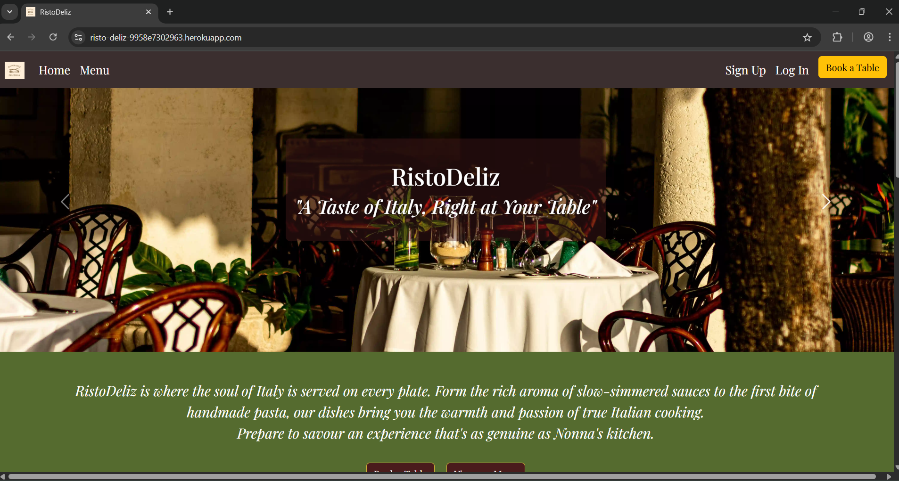 |
| **Firefox** |   Performs as intended      | 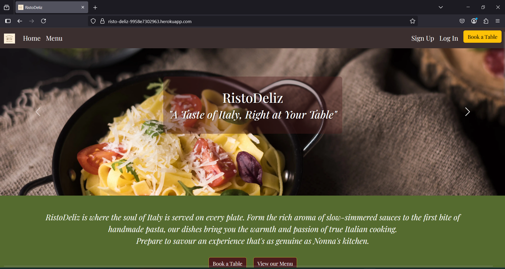 |
| **MS Edge** |   Performs as intended      | 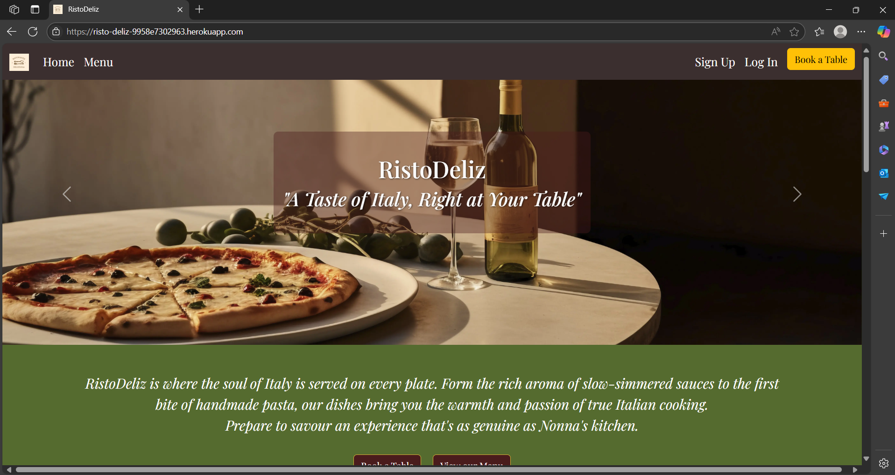 |
| **Opera**   |   Performs as intended      | 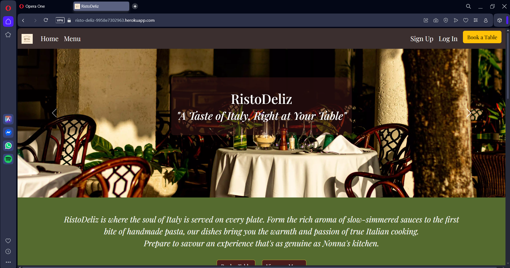 |

[Back To Top](#table-of-contents)

## Manual Testing
Defensive programming techniques—such as form validation, access control, and error handling—were manually tested through user acceptance scenarios. In addition, all buttons and links were manually tested to ensure they function correctly and navigate as intended.

### Navbar

| Action | Expected Result | Comment |
| --------------------- | -------------------------------------- | ---------------------------------------- |
| click on logo | should navigate to homepage | **Pass**- Achieves desired functionality |
| click on Home | should navigate to homepage | **Pass**- Achieves desired functionality |
| click on Menu | should navigate to menu page | **Pass**- Achieves desired functionality |
| click on Sign Up | should navigate to signup page | **Pass**- Achieves desired functionality |
| click on Log In | should navigate to login page | **Pass**- Achieves desired functionality |
| click on Book a Table | should navigate to booking form page | **Pass**- Achieves desired functionality |
| click on My Account | should navigate to user's dashboard | **Pass**- Achieves desired functionality |
| click on Log Out | logged out and redirect to log in page | **Pass**- Achieves desired functionality |

### Footer

| Action | Expected Result | Comment |
| ----------------------- | ---------------------------------------------------------- | ---------------------------------------- |
| click on Facebook Icon | should navigate to the facebook page in a separate window | **Pass**- Achieves desired functionality |
| click on Instagram Icon | should navigate to the instagram page in a separate window | **Pass**- Achieves desired functionality |
| click on X Icon | should navigate to the x page in a separate window | **Pass**- Achieves desired functionality |

### Homapage Buttons

| Action                                     | Expected Result                             | Comment                                  |
| ------------------------------------------ | ------------------------------------------- | ---------------------------------------- |
|  |  |                                          |
| click on Book a Table                      | should navigate to booking form page        | **Pass**- Achieves desired functionality |
| click on View our Menu                     | should navigate to Menu page                | **Pass**- Achieves desired functionality |
| click on Click here to join!               | should navigate to Sign Up page             | **Pass**- Achieves desired functionality |

### Menu Page Button

| Action | Expected Result | Comment |
| ----------- | ------- | ---------------------- |
| click on Back to Booking | should navigate to booking form page | **Pass**- Achieves desired functionality |

### Sign Up Form

| Action | Expected Result| Comment |
| ----------- | ------- | ---------------------- |
| Enter Username | Prompt the user to fill the field when username is blank | **Pass**- Achieves desired functionality |
| Enter First name | prompt the user to fill the field when first name is blank | **Pass**- Achieves desired functionality |
| Enter Last name | prompt the user to fill the field when last name is blank | **Pass**- Achieves desired functionality |
| Enter valid Password (twice) | field will only accept password format | **Pass**- Achieves desired functionality |
| Click Create Account | redirect user to user's dashboard | **Pass**- Achieves desired functionality |

### Log In Page

| Action | Expected Result | Comment |
| ----------- | ------- | ---------------------- |
| Enter Username | prompt the user to fill the field when username is blank | **Pass**- Achieves desired functionality |
| Enter Valid Password | only valid password will be accepted, incorrect password will display invalid email or password message | **Pass**- Achieves desired functionality |
| click on Log in | redirect user to user's dashboard | **Pass**- Achieves desired functionality |

### Dashboard/My Account

| Action                              | Expected Result                     | Comment                                  |
| ----------------------------------- | ----------------------------------- | ---------------------------------------- |
|  |  |                                          |
| no booking                          | no bookings yet message             | **Pass**- Achieves desired functionality |
| Click on Edit(booking exist)        | redirect user to user's edit form   | **Pass**- Achieves desired functionality |
| Click on Cancel(booking exist)      | redirect user to cancellation page  | **Pass**- Achieves desired functionality |
| Click on Back to Booking            | redirect user to booking form       | **Pass**- Achieves desired functionality |

### Booking Form / Edit Form

| Action | Expected Result | Comment |
| ----------- | ------- | ---------------------- |
| Enter the date | prompt the user to fill the field when date name is blank | **Pass**- Achieves desired functionality |
| Enter the time | prompt the user to fill the field when time is blank | **Pass**- Achieves desired functionality |  
| Enter the guest count | prompt the user to fill the field when guest count is blank | **Pass**- Achieves desired functionality |
| n/a | pre-filled email address | **Pass**- Achieves desired functionality |
| Enter phone number | prompt the user to fill the field when phone number is blank | **Pass**- Achieves desired functionality |
| nullable | Suggestion box is not required | **Pass**- Achieves desired functionality |
| Click on Book Now | if all fields are satisfied, it will redirect to the user's dashboard where the booking will reflect | **Pass**- Achieves desired functionality |
| Click on Save Changes(Edit Form) | if all fields are satisfied, it will redirect to the user's dashboard where the changes will reflect | **Pass**- Achieves desired functionality |

### Cancel Booking Page

| Action | Expected Result | Comment |
| ----------- | ------- | ---------------------- |
| Click on **Yes** | successfully cancelled page will display | **Pass**- Achieves desired functionality |  
| Click on **No** | redirect to user's dashboard | **Pass**- Achieves desired functionality |

### Cancel Success Page

| Action | Expected Result | Comment |  
| ----------- | ------- | ---------------------- |
| Click on Back to your account | redirect to user's dashboard | **Pass**- Achieves desired functionality |
| Click on Make a new booking | redirect to booking form | **Pass**- Achieves desired functionality |

[Back To Top](#table-of-contents)

## User Stories

| User Story                                                                                                                                                                                                                                                                                                                     | Comment                                | Screenshot                                     |
| ------------------------------------------------------------------------------------------------------------------------------------------------------------------------------------------------------------------------------------------------------------------------------------------------------------------------------ | -------------------------------------- | ---------------------------------------------- |
| As a user I want to sign up so that I can create an account and manage my bookings                                                                                                                                                                                                                                             | Achieves desired functionality         |     |
| As a user I want to log in so that I can securely view, create, update, or cancel my bookings.                                                                                                                                                                                                                                 | Achieves desired functionality         |         |
| As a user I want to select a date and time (separate fields) and the number of guests so that I can book a table for my party                                                                                                                                                                                                  | Achieves desired functionality         |  |
| As a user I want to update or cancel my existing booking so that I can change plans without contacting the restaurant directly.                                                                                                                                                                                                | Achieves desired functionality         |     |
| As a user I want to view the restaurant’s menu while booking so that I can plan my meal in advance.                                                                                                                                                                                                                            | Achieves desired functionality         |          |
| As a user I want to receive an email confirmation after booking so that I have a record of my reservation.                                                                                                                                                                                                                     | Achieves desired functionality         |         |
| As a user I want to know if the date and time is not available so that I avoid double-booking.                                                                                                                                                                                                                                 | Achieves desired functionality         |            |
| As a user I want the system to automatically assign me an appropriate table and prevent bookings that would exceed the restaurant’s 20-guest capacity per time slot so that I can be confident my reservation is both confirmed and within the restaurant’s limits, and I receive clear feedback if my requested slot is full. | Achieves desired functionality         |            |
| As a site owner I want to mark a booking as "Confirmed", "Cancelled", “Completed” or “No-show” so that I can keep accurate records of actual seating.                                                                                                                                                                          | Achieves desired functionality         |     |
| As a site owner I want to view a list of all bookings so that I can manage the restaurant’s schedule (CRUD).                                                                                                                                                                                                                   | Achieves desired functionality         |   |
| As a site owner I want to prevent overlapping bookings for the same table at the same date/time so that I avoid double-bookings.                                                                                                                                                                                               | Functionality achieved but bug present |        |

[Back To Top](#table-of-contents)

## Bugs

| Bug                            | Summary                                                        | Fix                                                                                                          | Screenshot                                    |                                               |
| ------------------------------ | -------------------------------------------------------------- | ------------------------------------------------------------------------------------------------------------ | --------------------------------------------- | --------------------------------------------- |
| Booking allowed for past dates | Users could create or edit bookings for past date/time values. | Added validation in booking and editing views to block past date/time selections using datetime.now() check. |  |  |

**Existing Bug**
| Bug | Summary | Screenshot |
| ----------- | ------- | ---------------------- |
| Duplicate Error Messages on Guest Limit Exceeded | In the Django admin panel, exceeding the guest limit triggers two identical error messages instead of one. The limit enforcement works correctly, but the duplicate messages affect clarity.|  |

[Back To Top](#table-of-contents)
